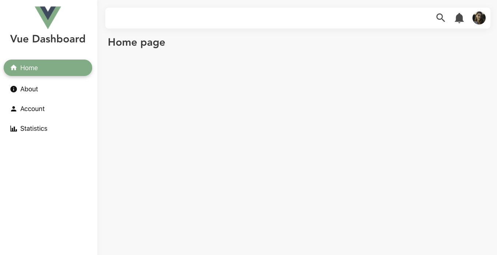

# Vue Dashboard


A simple, lightweight and responsive layout for your next Vue.js dashboard

Example:



## Quick start

### 1- Install
``` bash
# yarn
yarn add vue-dashboard-vd
```
``` bash
# npm
npm install vue-dashboard-vd
```
### 2- Import
``` javascript
import Vue from 'vue';
import VueDashboard from 'vue-dashboard-vd';
import 'vue-dashboard-vd/dist/vue-dashboard-vd.css';

Vue.use(VueDashboard);
```

## Usage

**App.vue**
``` html
<template>
  <div id="app">
    <vd-dashboard
      content="router-view"
      sidebarHeaderHeight="150px"
      headerItems="header-items"
      sidebarHeader="sidebar-header"
      sidebarItems="sidebar-items"
    ></vd-dashboard>
  </div>
</template>
```
`header-items`, `sidebar-header` and `sidebar-items` must be globally available components:

**main.ts**
``` javascript
import HeaderItems from '@components/HeaderItems.vue';
import SidebarHeader from '@components/SidebarHeader.vue';
import SidebarItems from '@components/SidebarItems.vue';

Vue.component('header-items', HeaderItems);
Vue.component('sidebar-items', SidebarItems);
Vue.component('sidebar-header', SidebarHeader);
```

Examples for these components can be found [here](https://github.com/SebastienBtr/vue-dashboard/blob/master/src/example/components).

## Found this project useful? ❤️
If you found this project useful, then please consider giving it a ⭐️ on Github and sharing it with your friends via social media.

## Issues and feedback 💭
If you have any suggestion for including a feature or if something doesn't work, feel free to open a Github [issue](https://github.com/SebastienBtr/vue-dashboard/issues) for us to have a discussion on it.